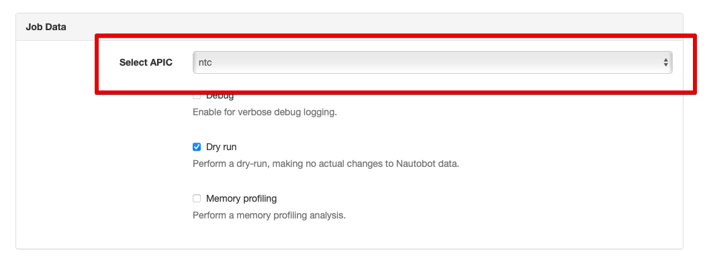
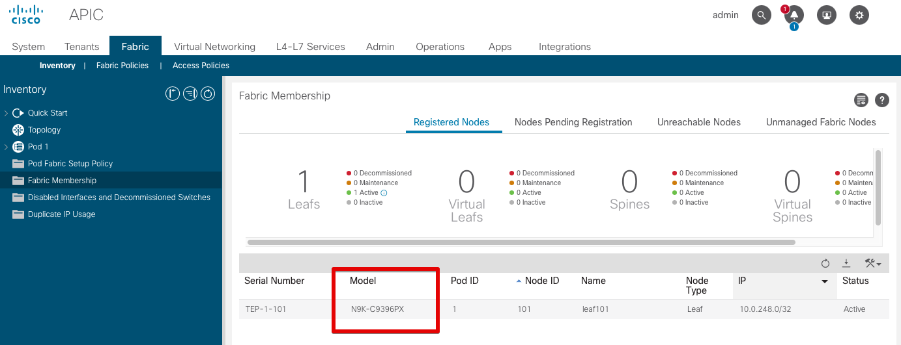

# Cisco ACI Integration Setup

This guide will walk you through steps to set up Cisco ACI integration with the `nautobot_ssot` App.

## Prerequisites

Before configuring the integration, please ensure, that `nautobot-ssot` App was [installed with integration extra dependencies](./install.md#install-guide).

```shell
pip install nautobot-ssot[aci]
```

## Configuration

Integration behavior can be controlled with the following settings:

| Setting Name<br>(* required) | Type | Description |
|---|:---:|---|
| <p>aci_apics_*</p> |  | Per-APIC settings. See per-APIC settings section for details. |
| aci_tag* | _String_ | Tag which is created and applied to all <br>synchronized objects. |
| aci_tag_color* | _String_ | Hex color code used for the tag. |
| aci_tag_up* | _String_ | Tag indicating the state applied to synchronized <br>interfaces. |
| aci_tag_up_color* | _String_ | Tag color applied to the "UP" tag on interface <br>status. |
| aci_tag_down* | _String_ | Tag indicating the state applied to synchronized <br>interfaces. |
| aci_tag_down_color* | _String_ | Tag color applied to the "DOWN" tag on interface <br>status. |
| aci_manufacturer_name* | _String_ | Manufacturer name. Specifically existing, or a new <br>one with this name will be created. |
| aci_ignore_tenants* | _List[String]_ | List of ACI Tenants that should not be synchronized<br>from APIC. |
| aci_comments* | _String_ | Comment added to synchronized objects. |

Below is an example snippet from `nautobot_config.py` that demonstrates how to enable and configure Cisco ACI integration:

```python
PLUGINS_CONFIG = {
    "nautobot_ssot": {
        "enable_aci": True,
        # URL and credentials should be configured as environment variables on the host system
        "aci_apics": {x: os.environ[x] for x in os.environ if "APIC" in x},
        # Tag which will be created and applied to all synchronized objects.
        "aci_tag": "ACI",
        "aci_tag_color": "0047AB",
        # Tags indicating state applied to synchronized interfaces.
        "aci_tag_up": "UP",
        "aci_tag_up_color": "008000",
        "aci_tag_down": "DOWN",
        "aci_tag_down_color": "FF3333",
        # Manufacturer name. Specify existing, or a new one with this name will be created.
        "aci_manufacturer_name": "Cisco",
        # Exclude any tenants you would not like to bring over from ACI.
        "aci_ignore_tenants": ["common", "mgmt", "infra"],
        # The below value will appear in the Comments field on objects created in Nautobot
        "aci_comments": "Created by ACI SSoT Plugin",
    }
```

### Per-APIC settings

The APIC URL and credentials need to be created as environment variables on the host system.

You can configure multiple APIC instances for synchronization. To do this, append `_` character, followed by an identifier, to the names of environment variables.

In the example below, configured APIC uses `NTC` for an identifier. Instead of `NTC` you could, for example, use `CHCG01` to configure an APIC instance in your Chicago facility.

```bash
export NAUTOBOT_APIC_BASE_URI_NTC=https://aci.cloud.networktocode.com
export NAUTOBOT_APIC_USERNAME_NTC=admin
export NAUTOBOT_APIC_PASSWORD_NTC=not_so_secret_password
export NAUTOBOT_APIC_VERIFY_NTC=False
export NAUTOBOT_APIC_SITE_NTC="NTC ACI"
export NAUTOBOT_APIC_TENANT_PREFIX_NTC="NTC_ACI"
```

The identifier is used to select APIC from the SSoT dashboard when initiating a synchronization job:



## Nautobot Objects Affected by Settings

A Site will be created in Nautobot with the name specified in the `NAUTOBOT_APIC_SITE` environment variable and resources created by the plugin will be assigned to this site.

Tenants imported from ACI will be prepended with the unique name specified by the corresponding `TENANT_PREFIX` variable. This uniquely identifies tenants which might have the same name, but belong to two different APIC clusters.

## Configuring Device Templates

To create a new Nautobot Device Type mapping to a specific ACI leaf or spine switch model you need to provide YAML file describing that model.  This model definition includes interface template with the ports and transceiver types (ex. 10GE SFP+) specification.

The YAML files need to be placed in the `nautobot_ssot/integrations/aci/diffsync/device-types` directory. Their names need to match the model name as it appears in the ACI  Fabric Membership area of the APIC dashboard.

For example, given a Model name of `N9K-C9396PX` as shown below, the YAML file should be named `N9K-C9396PX.yaml`.



There are example YAML files for a few common switch models in `nautobot_ssot/integrations/aci/diffsync/device-types`, and additional ones can be downloaded [here](https://github.com/netbox-community/devicetype-library/tree/master/device-types/Cisco).

## Upgrading from `nautobot-plugin-ssot-aci` App

!!! warning
    When upgrading from `nautobot-plugin-ssot-aci` App, it's necessary to [avoid conflicts](install.md#potential-apps-conflicts).

- Uninstall the old App:
    ```shell
    pip uninstall nautobot-plugin-ssot-aci
    ```
- Upgrade the App with required extras:
    ```shell
    pip install --upgrade nautobot-ssot[aci]
    ```
- Fix `nautobot_config.py` by removing `nautobot_plugin_ssot_aci` from `PLUGINS` and merging App configuration into `nautobot_ssot`:
    ```python
    PLUGINS = [
        "nautobot_ssot",
        # "nautobot_plugin_ssot_aci"  # REMOVE THIS LINE
    ]

    PLUGINS_CONFIG = {
        # "nautobot_plugin_ssot_aci": {  REMOVE THIS APP CONFIGURATION
        #     MOVE CONFIGURATION TO `nautobot_ssot` SECTION
        #     "apics": {x: os.environ[x] for x in os.environ if "NAUTOBOT_APIC" in x},
        #     "tag": "ACI",
        #     ...
        # }
        "nautobot_ssot": {
            # Enable Cisco ACI integration
            "enable_aci": True,
            # Following lines are moved from `nautobot_plugin_ssot_aci` and prefixed with `aci_`
            "aci_apics": {x: os.environ[x] for x in os.environ if "NAUTOBOT_APIC" in x},
            "aci_tag": "ACI",
            ...
        }
    }
    ```

!!! note
    Configuration keys are prefixed with `aci_`.

!!! note
    Environment variables defining APICs access must contain `APIC`.
    Other environment variables for this integration are prefixed with `NAUTOBOT_SSOT_ACI_`.
